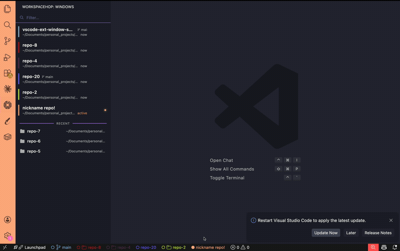
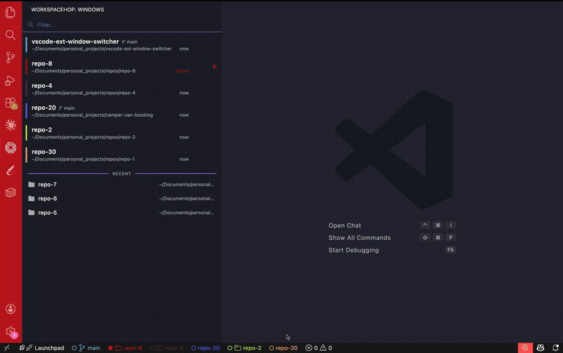

  

# WorkspaceHop

**Easily switch between VS Code windows** — tabs navigation, color identity, custom nicknames, workspace creation, and more.

WorkspaceHop gives each VS Code workspace a persistent identity: a color, a nickname, and a place in your status bar. Jump between windows instantly with a keyboard-driven switcher or browse them from the activity bar. Recently closed workspaces are remembered too, so you can reopen them just as quickly.

---

## Features

### Status Bar Tabs

Every open VS Code window appears as a clickable tab in the status bar. Tabs show the workspace nickname, git branch, or folder name — whichever is most specific — along with an active/inactive indicator. Clicking your own tab opens the color picker; clicking another window's tab brings it into focus.

---

### Activity Bar Panel

The WorkspaceHop panel in the activity bar shows all open windows at a glance, including their color accent, nickname, git branch, path, and time since last activity. A search bar lets you filter by any of these fields. Recent (closed) workspaces appear in a separate section below.

---

### Window Switcher

Press `Cmd+Shift+W` (macOS) or `Ctrl+Shift+W` (Windows/Linux) to open the full-screen overlay switcher. Navigate with arrow keys, type to filter, and hit Enter to jump to any window. Recent workspaces are listed below currently open windows.

---

### Color Identity & Color Picker

Assign a unique accent color to each workspace so you always know which window you're in at a glance. The color appears in the status bar tab and as a left accent bar in the sidebar and switcher panels.

---

### Nicknames

Give any workspace a friendly name - it takes priority over the branch name and folder name everywhere in the UI. Edit it via the pencil icon in the switcher or sidebar.

---

### Workspace Reordering

Drag and drop tabs in the sidebar panel to reorder your workspaces. The custom order is persisted across sessions and respected in both the sidebar and the status bar.

---

### Create Workspace

Launch a new workspace directly from WorkspaceHop without leaving your current window. Two modes are supported:

- **Open local folder** — pick any folder on disk and open it as a new VS Code workspace.
- **New git worktree** — create a `git worktree` branching off your current repo, with an auto-suggested path and branch name prompt.

During creation you can set a **nickname**, and WorkspaceHop will automatically assign an **accent color** not already used by any open window. You can also specify an optional **post-create command** (e.g. `npm install`) that runs automatically when the new window opens. Recent commands are remembered for quick reuse.

---

## Commands

| Command | Description |
|---|---|
| `WorkspaceHop: Open Window Switcher` | Open the keyboard-driven window switcher overlay |
| `WorkspaceHop: Set Workspace Color` | Open the color picker for the current workspace |
| `WorkspaceHop: Create Workspace` | Create a new workspace (local folder or git worktree) |

## Keybindings

| Keybinding | Action |
|---|---|
| `Cmd+Shift+W` / `Ctrl+Shift+W` | Open window switcher |

## Settings

| Setting | Type | Default | Description |
|---|---|---|---|
| `workspacehop.accentOpacity` | number | `1` | Opacity of the color accent in the status bar (0–1) |
| `workspacehop.manageGitSkipWorktree` | boolean | `true` | When enabled, sets git's `skip-worktree` flag on `.vscode/settings.json` so per-window color changes don't appear as modified in `git status`. Disable if you prefer to manage this yourself. |

---

## License

MIT
