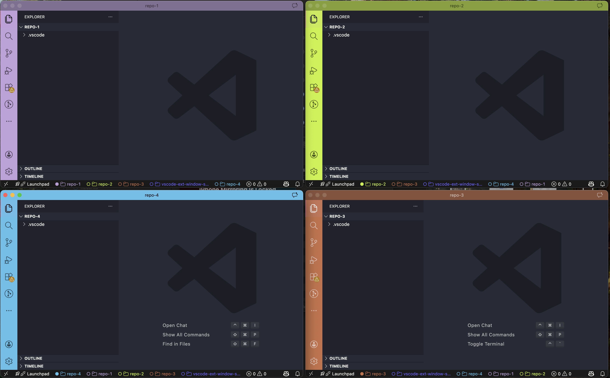
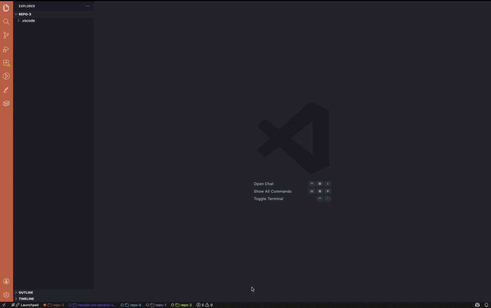
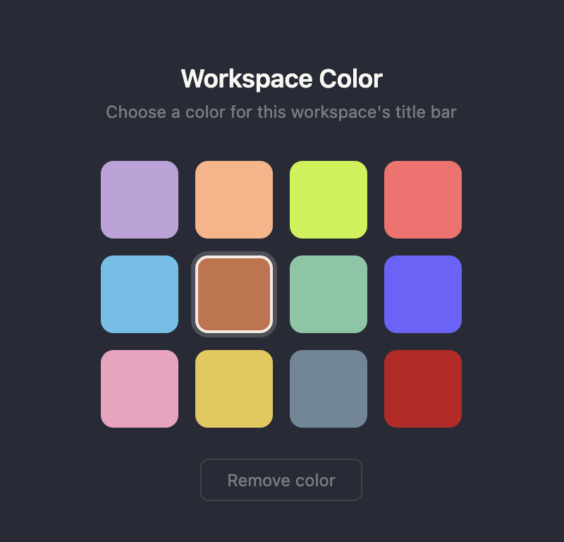
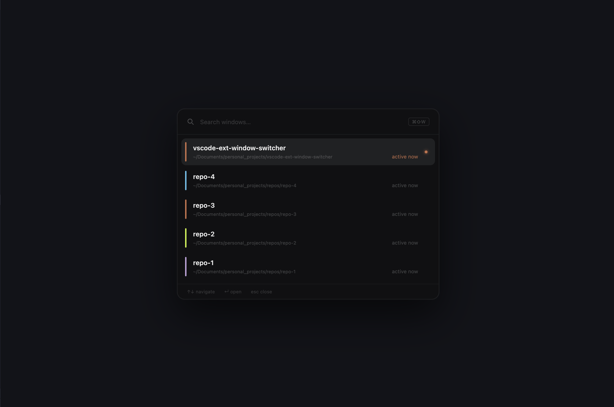

# WorkspaceHop

Fast keyboard-driven window switcher and per-workspace color identity for VS Code.

When you have multiple VS Code windows open across different projects, WorkspaceHop lets you jump between them instantly and tells them apart at a glance — each workspace gets its own title bar color that persists across sessions.



---

## Features

### Status Bar Tabs

Every open VS Code window shows a tab row in its own status bar listing all other open windows.

- Each tab shows the git branch (or folder name if not a git repo)
- Colored text if that workspace has a color set: `● main` (active) / `○ main` (inactive)
- Click any tab to jump to that window
- Click your own tab (the active one) to open the color picker



### Workspace Colors

Assign a persistent color to any workspace via the command palette: **WorkspaceHop: Set Workspace Color**.

- Pick from 12 handpicked colors (Ember, Sky, Jade, Violet, Rose, Cyan, Amber, Indigo, Coral, Mint, Blush, Sand)
- The color tints the title bar, activity bar, and window chrome
- Colors are saved per-workspace and automatically restored when you reopen the window
- Stored in your personal VS Code settings — never written to `.vscode/settings.json`, so nothing leaks into git



### Window Switcher

Open a floating switcher panel with `Cmd+Shift+W` (Mac) / `Ctrl+Shift+W` (Windows/Linux).

- All open VS Code windows are listed with their repo name, current git branch, and path
- The current window is pinned to the top; others are sorted by most recently active
- Type to filter by repo name or branch
- Navigate with `↑` / `↓`, confirm with `Enter`, dismiss with `Escape`
- Each entry shows a color accent bar if a workspace color has been set


---

## Commands

| Command | Description |
|---|---|
| `WorkspaceHop: Open Window Switcher` | Open the floating switcher panel |
| `WorkspaceHop: Set Workspace Color` | Open the color picker for this workspace |

**Default keybinding:** `Cmd+Shift+W` / `Ctrl+Shift+W` — opens the window switcher.

---

## Usage Examples

**Jumping to a window from the status bar**

Click any tab in the bottom status bar. The tab for the current window shows a filled dot (`●`); other windows show an outline dot (`○`) when they have a color assigned.


**Assigning a color to a workspace**

1. Open the Command Palette (`Cmd+Shift+P`)
2. Run `WorkspaceHop: Set Workspace Color`
3. Click a color swatch — the title bar updates immediately
4. The color is remembered and reapplied every time you open this workspace


**Switching windows**

1. Press `Cmd+Shift+W`
2. Start typing a repo name or branch — e.g. `feat` to find `feat/auth`
3. Press `Enter` to jump to that window

---

## Installation

Install from a `.vsix` file:

1. Open VS Code
2. Run `Extensions: Install from VSIX…` from the Command Palette
3. Select `workspacehop-0.1.0.vsix`

Or via the CLI:

```sh
code --install-extension workspacehop-0.1.0.vsix
```

---

## Requirements

- VS Code 1.88 or later
- For title bar coloring: enable the custom title bar via **Window: Title Bar Style → custom**, or accept the prompt WorkspaceHop shows on first activation

---

## Color Palette

| Name | Hex |
|---|---|
| Ember | `#F97316` |
| Sky | `#3B82F6` |
| Jade | `#22C55E` |
| Violet | `#A855F7` |
| Rose | `#F43F5E` |
| Cyan | `#06B6D4` |
| Amber | `#EAB308` |
| Indigo | `#6366F1` |
| Coral | `#EF4444` |
| Mint | `#10B981` |
| Blush | `#EC4899` |
| Sand | `#D97706` |
